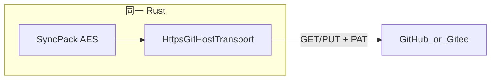

# 跨端数据同步方案（不自建后端）

目标：Windows / macOS / Linux / Android /（后续）iOS **同一套加密数据**互通，**不运营自有服务器**。

## 已落地（当前）

**加密 Sync Pack + 第三方私有仓 + 端上 `HTTPS + PAT`（Contents API）**

- 实现：[`src-tauri/src/services/sync_https.rs`](../src-tauri/src/services/sync_https.rs)
- Provider：**GitHub**、**Gitee**（AtomGit 暂未接入，会提示换仓）
- 依赖：`reqwest` + `rustls-tls`（避免 OpenSSL，利于 Android）
- 解锁后软拉取、设置页手动推拉：桌面与 Android **同一路径**
- 退出**不**自动 push

远端仓固定路径：

- `sync/latest.posenc`
- `sync/manifest.json`

## 使用步骤

详见逐步手册：**[git-config-transfer.md](./git-config-transfer.md)**（电脑导出配置 → 手机导入 → 拉推）。

摘要：

1. 在 GitHub/Gitee 建**私有**空仓；创建带 `repo`（或 Gitee 私有仓读写）的 PAT  
2. 设置 →「配置新建」填 URL / 用户名 / 分支 / PAT →「测试连接」→「保存」→ 右下角 **推**  
3. 「配置同步」复制加密配置或导出文件 → 发到手机 → 粘贴导入  
4. 配置包内含同步密钥，与两端登录码是否相同无关；**启动/退出不会自动同步**  
5. 之后各端随时用悬浮图标 **拉 / 推**

## 方案对比（决策记录）

| 方案 | 判定 |
|------|------|
| 系统 `git` CLI | 仅桌面；Android 不可行 |
| 内置 libgit2 | 成本高，非 P0 |
| 自建后端 | 不做 |
| **HTTPS Contents API** | **已实现** |

## 以后

- AtomGit Contents 适配  
- 冲突历史 UI（当前单文件快照：拉覆盖旧远端 hash，推覆盖远端文件）  
- iOS 共用同一 Rust（需 Mac 出包）
